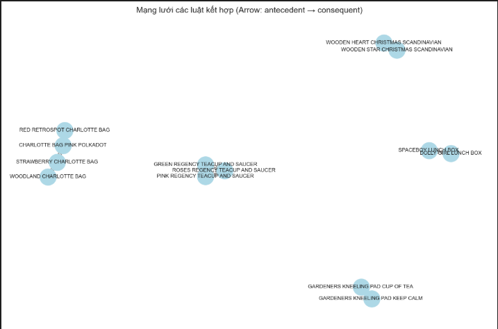
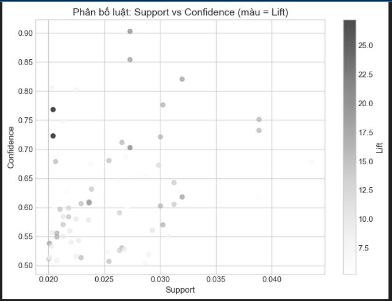

# 📦 Case Study: Giải mã bí mật giỏ hàng - Khi "Trái tim gỗ" và "Ngôi sao" là định mệnh

## 👥 Thông tin Nhóm
- **Nhóm:** [TAM ĐẠI QUỶ VƯƠNG]
- **Thành viên:** - [Nguyễn Phương Nam]
                  - [Trần Mạnh Tiến]
                  - [Phạm văn Huy]
- **Chủ đề:** Phân tích luật kết hợp (Association Rules) để tối ưu chiến lược bán chéo (Cross-sell).
- **Dataset:** Online Retail (UCI Machine Learning Repository) - Tập trung vào thị trường UK.

## Mục tiêu 
Mục tiêu của nhóm là chuyển đổi dữ liệu giao dịch thô thành tri thức kinh doanh hữu ích. Cụ thể: tìm ra các cặp sản phẩm có mối quan hệ chặt chẽ nhất (Lift cao) để thiết kế các gói Combo khuyến mãi và tối ưu hóa vị trí trưng bày hàng hóa nhằm gia tăng giá trị trung bình đơn hàng (AOV).

## 1. Ý tưởng & Feynman Style
**Giải thích Apriori cho "bà ngoại" cũng hiểu:**

Hãy tưởng tượng Apriori giống như một **người quản lý siêu thị có trí nhớ siêu phàm**. Thay vì đoán mò xem khách hàng thích mua gì, ông ta ghi nhớ hàng triệu hóa đơn trong đầu để tìm ra quy luật:
> *"Cứ hễ ai mua Bánh mì thì 80% sẽ mua thêm Bơ."*

Để đánh giá một "mối tình" giữa hai sản phẩm, ông ta dùng 3 thước đo:
1.  **Support (Độ phổ biến):** Cặp đôi này có nổi tiếng không? Có nhiều người mua không?
2.  **Confidence (Độ chung thủy):** Đã "yêu" A rồi thì bao nhiêu phần trăm sẽ "cưới" luôn B?
3.  **Lift (Định mệnh):** Đây là chỉ số quan trọng nhất. 
    - Nếu Lift = 1: Hai đứa đi cùng nhau chỉ là ngẫu nhiên (như người dưng ngược lối).
    - **Nếu Lift > 1:** Hai đứa sinh ra là để dành cho nhau. Lift càng cao, mối tình càng nồng thắm.

**Tại sao dùng cho bài toán này?**
Với hơn 4.000 mã sản phẩm, con người không thể nhìn bằng mắt thường để thấy hết các cặp đôi. Apriori giúp "quét" sạch mọi ngóc ngách để không bỏ lỡ bất kỳ cơ hội bán hàng nào.

## 2. Quy trình Thực hiện
Quy trình chuẩn Data Science được áp dụng:
1) **Data Cleaning:** Làm sạch nhiễu, xử lý dữ liệu âm/hủy.
2) **Basket Preparation:** Gom nhóm sản phẩm theo từng hóa đơn (One-hot encoding).
3) **Parameter Tuning:** Thử nghiệm độ nhạy tham số (Support/Confidence) để tìm điểm tối ưu.
4) **Modeling:** Áp dụng thuật toán Apriori & Association Rules.
5) **Visualization:** Vẽ đồ thị mạng lưới (Network Graph) để nhìn tổng quan.
6) **Business Insight:** Đề xuất chiến lược từ số liệu.

## 3. Tiền xử lý Dữ liệu
Dữ liệu thực tế rất "bẩn", nhóm đã thực hiện các bước lọc nghiêm ngặt:
- **Loại bỏ đơn hàng hủy:** Các dòng có `InvoiceNo` bắt đầu bằng 'C' (Cancelled) bị loại bỏ để không làm sai lệch luật.
- **Lọc giá trị hợp lệ:** Chỉ giữ lại `Quantity > 0` và `UnitPrice > 0`.
- **Xử lý Missing Data:** Loại bỏ các giao dịch không có `CustomerID` (để đảm bảo phân tích hành vi khách hàng chính xác).
- **Phạm vi địa lý:** Chỉ chọn quốc gia **United Kingdom** (chiếm đa số dữ liệu) để tránh nhiễu do hành vi mua sắm khác biệt giữa các nước.

**Thống kê sơ bộ:**
- Số lượng giao dịch sau khi làm sạch: ~390.000 dòng.
- Số lượng sản phẩm (Items): ~4.000 mã.

## 4. Áp dụng Apriori & Thử nghiệm tham số
Đây là bước quan trọng nhất. Nhóm đã không chọn bừa tham số mà thực hiện quy trình **tinh chỉnh mô hình (Fine-tuning)** qua 2 kịch bản:

**Kịch bản 1: Thăm dò (Support = 1%)**
- Kết quả: Sinh ra **1.794 luật**.
- Nhận xét: Quá nhiều luật rác, độ nhiễu cao, khó ứng dụng vào kinh doanh thực tế.

**Kịch bản 2: Tinh hoa (Support = 2%) - CHỐT PHƯƠNG ÁN NÀY**
- Nhóm quyết định siết chặt tiêu chuẩn để tìm ra những luật "Best-seller".
- **Tham số cuối cùng:**
    - `min_support = 0.02` (Sản phẩm phải xuất hiện trong ít nhất 2% số đơn hàng).
    - `min_confidence = 0.5` (Độ tin cậy tối thiểu 50%).
    - `min_lift = 2.0` (Chỉ lấy các cặp có quan hệ mạnh gấp đôi ngẫu nhiên).
- **Kết quả:** Lọc còn **73 luật** chất lượng nhất.

```python
# Code minh họa cấu hình tham số tối ưu
from mlxtend.frequent_patterns import apriori, association_rules

# 1. Tìm tập phổ biến
frequent_itemsets = apriori(basket_bool, min_support=0.02, use_colnames=True)

# 2. Sinh luật kết hợp
rules = association_rules(frequent_itemsets, metric="lift", min_threshold=1.0)

# 3. Lọc luật theo tiêu chuẩn "Strict"
filtered_rules = rules[
    (rules['confidence'] >= 0.5) &
    (rules['lift'] >= 2.0)
]
```

### 5. Trực quan hóa (Visualization)

**Hình 1:** Biểu đồ Network Graph của 73 luật mạnh nhất. Các cụm sản phẩm (Communities) tách biệt rõ ràng: Nhóm Tách trà, Nhóm Túi Jumbo, Nhóm Trang trí Giáng sinh.



**Hình 2:** Biểu đồ phân tán (Scatter Plot). Trục tung là Confidence, trục hoành là Support. Các điểm ở góc trên bên phải là các "luật vàng" (vừa phổ biến vừa tin cậy).


## 6. Insight từ Kết quả
Dựa trên bảng kết quả (đã sắp xếp theo Lift), nhóm rút ra 5 insight đắt giá:

### Insight #1: Cặp đôi "Giáng Sinh Scandinavian" (Lift ~ 27.2)
- **Sự thật:** Cặp sản phẩm *Wooden Heart* và *Wooden Star* (Trang trí Giáng sinh) có chỉ số Lift kỷ lục (27.2). Khách mua "Tim" thì 77% sẽ mua "Sao".
- **Ý nghĩa:** Đây là cặp bài trùng không thể tách rời, mang tính chất mùa vụ và thẩm mỹ đồng bộ.
- **Hành động:** Đóng gói combo "Scandi Xmas Set".

### Insight #2: Bộ sưu tập "Tiệc trà quý tộc" (High Confidence)
- **Sự thật:** Các bộ tách trà *Regency Teacup* (Green, Pink, Roses) liên kết chặt chẽ. Ví dụ: Mua *Green* + *Pink* thì 90% sẽ mua *Roses*.
- **Ý nghĩa:** Khách hàng có tâm lý sưu tập đủ bộ màu sắc (Collectibles).
- **Hành động:** Bán theo set 3 màu hoặc 4 màu thay vì bán lẻ từng cái.

### Insight #3: Sản phẩm trung tâm "Hub" - Jumbo Bag
- **Sự thật:** Sản phẩm *Jumbo Bag Red Retrospot* xuất hiện ở trung tâm của đồ thị mạng lưới, kết nối với nhiều loại túi khác (Baroque, Strawberry...).
- **Ý nghĩa:** Đây là sản phẩm "mồi" (Traffic driver), thu hút sự chú ý đầu tiên của khách hàng.
- **Hành động:** Đặt kệ túi Jumbo ngay lối đi chính.

### Insight #4: Cặp đôi "Ăn trưa văn phòng" (Functional Pair)
- **Sự thật:** *Lunch Bag Red Retrospot* và *Lunch Bag Pink Polkadot* thường đi cùng nhau.
- **Ý nghĩa:** Có thể khách mua cho cặp đôi, cho mẹ và bé, hoặc mua thay đổi. Đây là nhóm sản phẩm chức năng.

### Insight #5: Paper Chain Kit (Mùa vụ)
- **Sự thật:** Các bộ *Paper Chain Kit (Vintage Christmas)* bán rất chạy cùng nhau.
- **Hành động:** Sản phẩm DIY (Tự làm) thường bán tốt hơn khi có gợi ý mẫu. Nên quay video hướng dẫn làm dây xích giấy và để link mua combo bên dưới.

## 7. Kết luận & Đề xuất Kinh doanh
Từ việc phân tích 73 luật kết hợp chất lượng cao, chúng tôi đề xuất chiến lược **"3C"** cho cửa hàng:

- **C - Combo (Gói hàng):** Tạo ngay các Combo quà tặng Giáng sinh (Gỗ + Sao) và Combo Tiệc trà (Bộ 3 tách). Việc này giúp tăng giá trị đơn hàng ngay lập tức.
- **C - Connection (Sắp xếp):** Thay đổi layout cửa hàng/website. Đặt các sản phẩm có Lift cao cạnh nhau. Khi khách xem "Tách trà hồng", hệ thống phải gợi ý ngay "Tách trà xanh".
- **C - Central (Tập trung):** Dùng túi Jumbo Bag làm sản phẩm chủ đạo trong các chiến dịch quảng cáo để kéo traffic, sau đó dùng thuật toán để cross-sell các sản phẩm ngách khác.

## 8. Link Code & Notebook
- **Notebook:** `notebooks/apriori_modelling.ipynb`
- **Source Code:** `src/apriori_library.py` (Class OOP)
- **Pipeline:** `run_papermill.py`

## 9. Slide trình bày
- **Link Slide:** [Em dùng PP để trình bày ạ]
